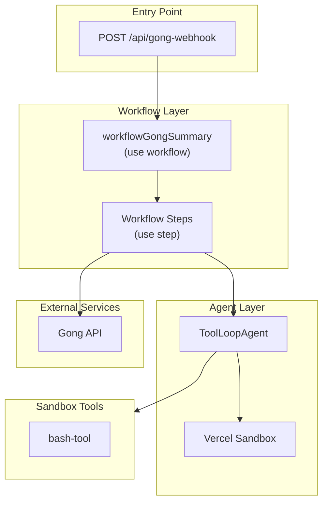

# Sales Call Summary Agent

An AI-powered agent that automatically summarizes sales calls using Vercel's Sandbox architecture. The agent analyzes call transcripts and generates structured summaries with objections, action items, and insights.

> **Template Note**: This template uses **Gong** as a starting example for call transcript integration. You can adapt it to work with other call recording platforms (Zoom, Google Meet, etc.) by modifying the webhook handler and transcript fetching logic.

> **Extensible**: This template can be extended to integrate with Salesforce (or another CRM of your choice), Slack (to post call summaries), and other services. The demo files in `/demo-files/context/` demonstrate how CRM data and other context can be provided to the agent.

## Features

- **Structured Summaries** - AI-generated summaries with tasks, objections, and key insights
- **Sandbox Agent** - Uses Vercel Sandbox for secure code execution and file exploration
- **[bash-tool](https://www.npmjs.com/package/bash-tool)** - Generic bash tool for AI agents, compatible with AI SDK
- **Demo Mode** - Works out of the box with mock data (no Gong credentials needed)
- **Objection Tracking** - Identifies and scores how well objections were handled
- **Durable Workflows** - Built with Vercel Workflow DevKit for reliability

---

## One-Click Deploy (Demo Mode)

You can deploy to Vercel and try it immediately with demo data with one click:

[](https://vercel.com/new/clone?build-command=npm%20run%20build&demo-description=Build%20an%20AI%20agent%20to%20analyze%20sales%20call%20data%20using%20Vercel%20Sandbox%20and%20AI%20SDK.%20Features%20secure%20code%20execution%20and%20durable%20workflows.&demo-image=%2F%2Fimages.ctfassets.net%2Fe5382hct74si%2F2YZvDQ9gCIBnjtV7hSZq4s%2F2759b0c065ad8a0627b24468bc7753fe%2FImage.png&demo-title=Call%20Summary%20AI%20Agent&demo-url=https%3A%2F%2Fcall-summary-agent-demo.labs.vercel.dev%2F&from=templates&install-command=npm%20install&project-name=Call%20Summary%20AI%20Agent&project-names=Comma%20separated%20list%20of%20project%20names%2Cto%20match%20the%20root-directories&repository-name=call-summary-agent&repository-url=https%3A%2F%2Fgithub.com%2Fvercel-labs%2Fcall-summary-agent-with-sandbox&root-directories=List%20of%20directory%20paths%20for%20the%20directories%20to%20clone%20into%20projects&skippable-integrations=1&teamSlug=andrewqu)


> Demo mode is **enabled by default** - no Gong credentials required to test!

---

## Local Development (Demo Mode)

### 1. Clone and Install

```bash
git clone https://github.com/vercel-labs/call-summary-agent
cd call-summary-agent
pnpm install
```

### 2. Link to Vercel (creates .env.local automatically)

```bash
vercel link
vercel env pull
```

### 3. Run

```bash
pnpm dev
```

### 4. Test

```bash
# Check status (should show demoMode: true)
curl http://localhost:3000/api/gong-webhook

# Trigger the agent with demo data
curl -X POST http://localhost:3000/api/gong-webhook \
  -H "Content-Type: application/json" \
  -d '{}'
```

---

## Production Setup (Real Gong Data)

To use real Gong API data instead of demo data:

### 1. Set Environment Variables

Add these to your Vercel project settings or `.env.local`:

| Variable | Required | Description |
|----------|----------|-------------|
| `GONG_ACCESS_KEY` | Yes | Your Gong API access key |
| `GONG_SECRET_KEY` | Yes | Your Gong API secret key |

```bash
GONG_ACCESS_KEY=your_gong_access_key
GONG_SECRET_KEY=your_gong_secret_key
```

> **Note:** Demo mode is automatically enabled when Gong credentials are missing.

### 2. Configure Gong Webhook

1. Go to your Gong settings > Integrations > Webhooks
2. Create a new webhook with:
   - **URL**: `https://your-app.vercel.app/api/gong-webhook`
   - **Events**: Select "Call completed"
3. Save and test the webhook

---

## Architecture



## Environment Variables

| Variable | Required | Default | Description |
|----------|----------|---------|-------------|
| `GONG_ACCESS_KEY` | No | - | Gong API access key (demo mode if missing) |
| `GONG_SECRET_KEY` | No | - | Gong API secret key (demo mode if missing) |
| `COMPANY_NAME` | No | "Your Company" | Company name in prompts |

## Demo Mode Details

Demo mode uses realistic mock data including a sample 20-minute product demo call. The demo files are organized in the `/demo-files` folder:

```
demo-files/
├── webhook-data.json              # Mock Gong webhook payload
├── transcript.json                # 20-minute call transcript
└── context/
    ├── gong-calls/previous/       # Historical calls
    │   ├── demo-call-000-discovery-call.md
    │   └── demo-call-intro-initial-call.md
    ├── research/                  # Background info
    │   ├── company-research.md
    │   └── competitive-intel.md
    └── playbooks/
        └── sales-playbook.md
```

These files are loaded into the sandbox for the agent to explore.

## Configuration

### Custom System Prompt

Override the default system prompt:

```bash
AGENT_SYSTEM_PROMPT="You are a sales call analyst..."
```

## How It Works

1. **Webhook Received**: Gong sends call data when a call completes (or mock data in demo mode)
2. **Workflow Started**: The durable workflow begins processing
3. **Transcript Fetched**: Call transcript is retrieved from Gong API (or mock data)
4. **Sandbox Created**: A secure sandbox is created with call files
5. **Agent Runs**: The AI agent explores transcripts using [bash-tool](https://www.npmjs.com/package/bash-tool)
6. **Summary Generated**: Structured output with tasks, objections, insights

### Workflow Steps

Each step uses the `"use step"` directive for:
- Automatic retries on failure
- State persistence
- Observability in Vercel dashboard

### Sandbox Tools

The agent uses [bash-tool](https://www.npmjs.com/package/bash-tool) for exploring call transcripts via shell commands:

```bash
# List call files
ls gong-calls/

# Search for pricing discussions
grep -r "pricing" gong-calls/

# View call metadata
cat gong-calls/metadata.json

# Find objections
grep -i "concern\|issue\|problem" gong-calls/*.md
```

All bash commands are logged for observability:
```
[bash-tool] INFO: Bash command starting { command: 'grep -r "pricing" gong-calls/' }
[bash-tool] INFO: Bash command completed { command: '...', exitCode: 0, stdoutLength: 605 }
```

## Output Schema

The agent generates structured output:

```typescript
{
  summary: string,           // Comprehensive call summary
  tasks: [{
    taskDescription: string,
    taskOwner: string,
    ownerCompany: 'internal' | 'customer' | 'partner'
  }],
  objections: [{
    description: string,
    quote: string,
    speaker: string,
    speakerCompany: string,
    handled: boolean,
    handledAnswer: string,
    handledScore: number,    // 0-100
    handledBy: string
  }]
}
```

## Customization

### Custom Playbooks

Add playbook detection by configuring `config.playbooks` in `lib/config.ts`.

## Development

```bash
# Install dependencies
pnpm install

# Run development server
pnpm dev

# Build for production
pnpm build
```

## Project Structure

```
sales-call-summary-agent/
├── app/
│   ├── api/gong-webhook/    # Webhook endpoint
│   ├── layout.tsx
│   └── page.tsx             # Status page
├── demo-files/              # Demo mode files
│   ├── webhook-data.json
│   ├── transcript.json
│   └── context/             # Additional context files
├── lib/
│   ├── agent.ts             # ToolLoopAgent configuration
│   ├── config.ts            # Centralized configuration
│   ├── gong-client.ts       # Gong API helpers
│   ├── mock-data.ts         # Demo mode loader
│   ├── sandbox-context.ts   # File generation for sandbox
│   ├── tools.ts             # Agent tools (bash-tool)
│   ├── types.ts             # TypeScript types
│   └── logger.ts            # Logging utility
└── workflows/
    └── gong-summary/
        ├── index.ts         # Main workflow
        └── steps.ts         # Workflow steps
```

## API Reference

### POST /api/gong-webhook

Receives Gong webhook payloads and triggers the summary workflow.

**Request Body**: Gong webhook payload or empty `{}` in demo mode.

**Response**:
```json
{
  "message": "Workflow triggered",
  "callId": "1234567890"
}
```

### GET /api/gong-webhook

Health check endpoint.

**Response**:
```json
{
  "status": "ok",
  "service": "sales-call-summary-agent",
  "demoMode": true,
  "configValid": true,
  "configErrors": []
}
```

## Output
The function returns a string output which can be configured into an outputSchema of your choice.

## Contributing

Contributions are welcome! Please open an issue or submit a pull request.
